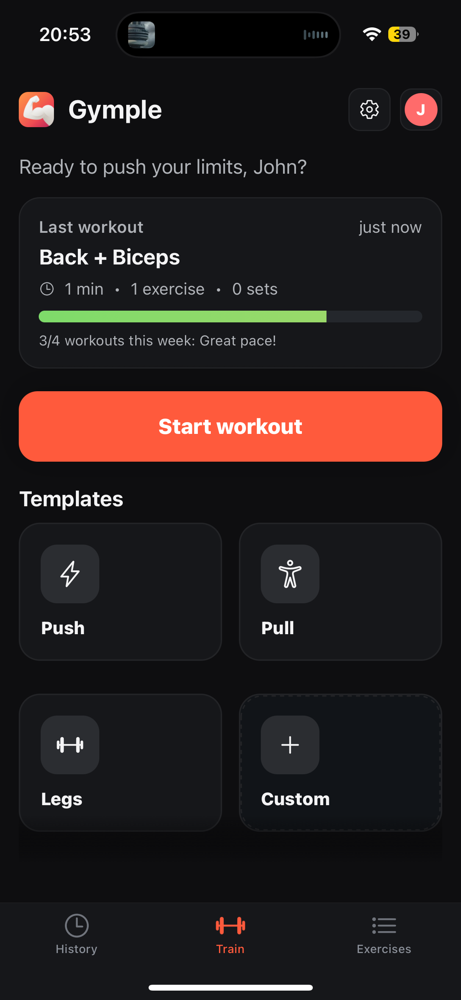
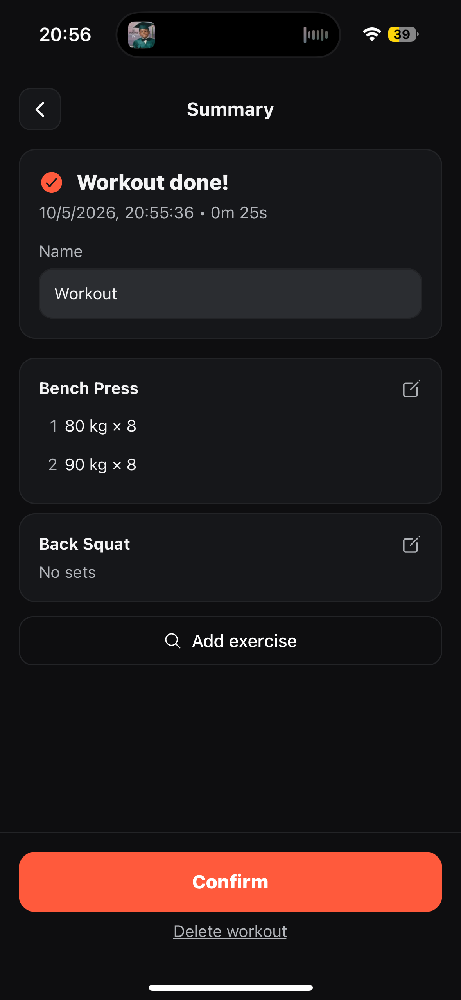
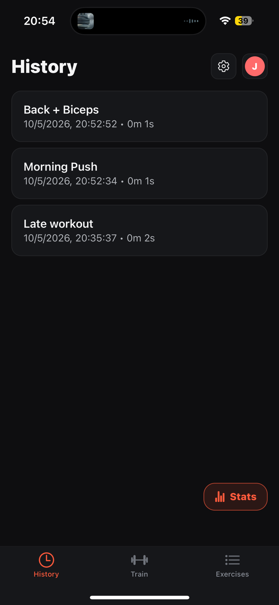
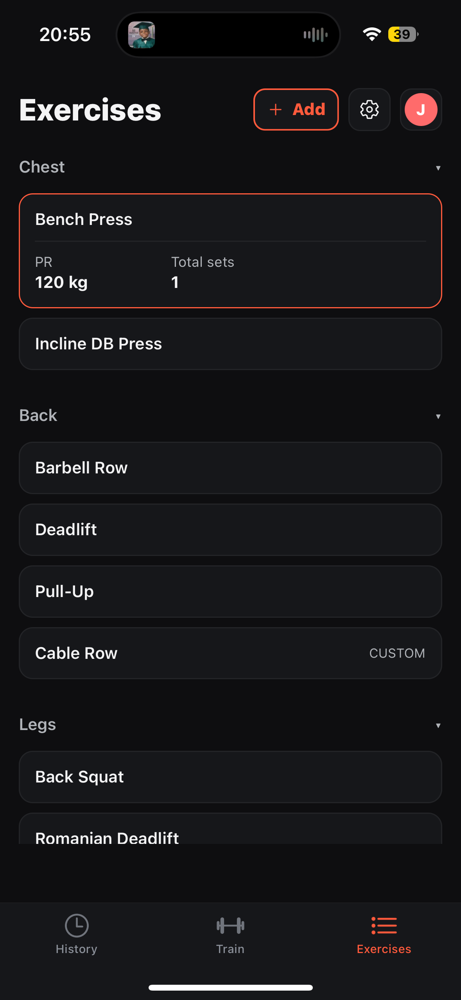
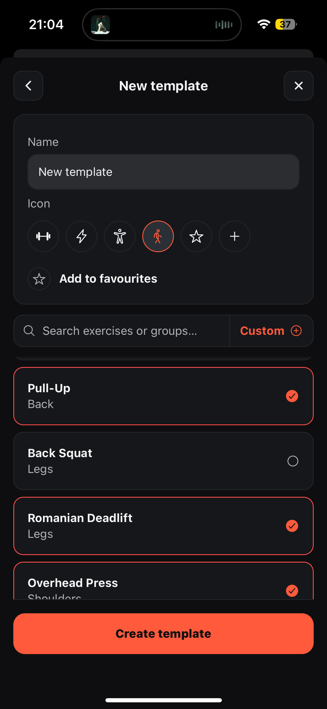
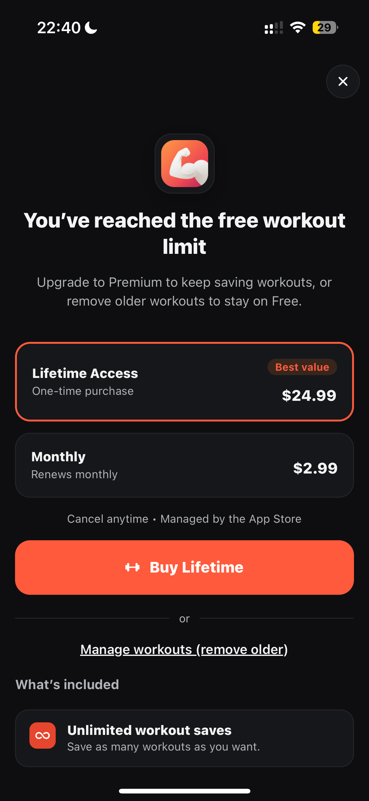

# Gymple - iOS Mobile Application

Gymple is a mobile workout tracking app built with React Native.

The app helps users log workouts, manage custom exercises, reuse training templates and review workout history. Gymple is live on the App Store after TestFlight validation.

[Download Gymple on the App Store](https://apps.apple.com/us/app/gymple/id6756895779)

## Previews

| Train | Workout Details | History |
| --- | --- | --- |
|  |  |  |

| Exercises | Templates | Premium |
| --- | --- | --- |
|  |  |  |

## Overview

Gymple was built as an end-to-end mobile product, covering the full flow from authentication and workout data storage to subscriptions, privacy pages and App Store release.

The goal was to keep workout logging fast and focused while still supporting the features expected from a real training app: account sync, editable history, custom exercises, reusable templates and premium limits.

## Core Functionality

- Workout logging with exercises, sets, reps and weight
- Workout history with saved training sessions
- Custom exercise library with duplicate-name protection
- Reusable workout templates
- Email/password authentication, Google sign-in and Sign in with Apple
- Account sync through Supabase
- Premium unlocks through Apple In-App Purchases and RevenueCat
- Account deletion flow backed by a Supabase Edge Function
- Localized UI in English, Polish and Italian
- Public Privacy Policy, Terms of Use and Support pages

## Product & Engineering Highlights

- Built and shipped as a production-oriented iOS app, not just a prototype
- Supabase Auth and PostgreSQL with Row Level Security for user-owned data
- Secure account deletion using a server-side Supabase Edge Function
- Apple In-App Purchase integration through RevenueCat entitlements
- TestFlight validation before App Store release
- App Store-ready privacy, terms and support documentation
- TypeScript codebase with focused release checks

## Technical Architecture

- **Mobile client:** React Native, Expo and TypeScript
- **Authentication:** Supabase Auth with email/password, Google and Apple sign-in
- **Database:** Supabase PostgreSQL with user-scoped workout, template and exercise data
- **Serverless backend:** Supabase Edge Function for account deletion
- **Purchases:** RevenueCat with Apple In-App Purchases
- **Legal pages:** Static GitHub Pages files served from the `docs` directory

## Tech Stack

- React Native
- Expo
- TypeScript
- Supabase Auth
- Supabase PostgreSQL
- Supabase Edge Functions
- RevenueCat
- Apple In-App Purchases
- iOS, TestFlight and App Store Connect

## Status

Gymple is live on the App Store:

https://apps.apple.com/us/app/gymple/id6756895779

This repository contains the mobile client, Supabase schema/reference files, the account deletion Edge Function and static legal/support pages.

## Local Development

Required public environment variables are documented in [`.env.example`](.env.example).

```bash
npm install
cp .env.example .env
npm run start
```

Run type checks:

```bash
npm run typecheck
```

Purchases do not run in Expo Go. Use a development build or TestFlight to test Apple In-App Purchases.

## Configuration Notes

The app expects the Supabase schema described in [supabase/schema.sql](supabase/schema.sql).

The account deletion backend is implemented in [supabase/functions/delete-account](supabase/functions/delete-account).

RevenueCat/App Store identifiers used by the app:

- Entitlement: `premium`
- Offering: `default`
- Monthly product: `com.gymple.premium.monthly`
- Lifetime product: `com.gymple.premium.life`

Additional release/setup notes are available in the [docs](docs) directory.
